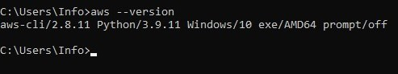

# Week 0 — Billing and Architecture

## Reqired Homework Tasks

1- I watched the tutorial videos.

- I spent some time watching tutorial videos to gain a better understanding of AWS and its services.
- I took notes on the key concepts and services covered in the videos to refer back to later.

2- I created a budget for my AWS account to help keep my expenses under control.

- I set up the budget in case my expenses exceed the limits.
- I set up two budgets: one for the free tier and one for the bootcamp budget.


- I set up alerts to notify me if my expenses reach certain thresholds, so I can take action to reduce my usage if necessary.
- I also set up an SNS topic to receive the alerts so that I can be notified via email or text message.


3- I generated access and secret keys for my AWS account so that I can use the AWS CLI to interact with my account.

- I generated the credentials and set up AWS CLI.
- I configured the AWS CLI with these credentials so that I can easily run commands from my local machine.
- I installed the aws cli on my local machine and tested it by running the command `aws --version` to check the version of the CLI that I have installed.


```
msiexec.exe /i https://awscli.amazonaws.com/AWSCLIV2.msi
msiexec.exe /i https://awscli.amazonaws.com/AWSCLIV2.msi /qn
aws --version
```


## Homework Challenges

4- I spent some time researching the best practices for setting up a CI/CD pipeline on AWS.

- I created the CI/CD pipeline architecture diagram.
- I created a diagram that outlines the various components of the pipeline, including the source code repository, build server, testing environment, and deployment mechanism.
- I also made notes on how each component of the pipeline is connected and the dependencies between them.

### CI/CD Pipeline Architecture Diagram
<a href="https://lucid.app/lucidchart/dc74d222-2278-4273-a741-269d7beaf5fb/edit?view_items=Yzbz3kuGTY39&invitationId=inv_b1a4980c-0ba6-4f57-96e8-8ba2e4d7b4b9" target="_blank">CI/CD Pipeline Architecture Diagram</a>


5- I drew a diagram that outlines the architecture of the application that we'll to deploy on AWS.

- I created the application architecture diagram.
- I included details about the various components of the application, such as the front-end, back-end, and database.
- I also made notes about the technologies and services that will be used to build and deploy the application, as well as any potential scalability or performance considerations.

### Application Architecture Diagram
<a href="https://lucid.app/lucidchart/c81b8184-1972-4182-bd25-b306e6a7b478/edit?view_items=3KbzM8XTKnAJ&invitationId=inv_423ed95a-be7e-4822-97f6-c345faa0780d" target="_blank">Application Architecture Diagram</a>


