# Week 1 — App Containerization

## Required Homework Tasks


1- Create a new GitHub repo.
- Launch the repo within a Gitpod workspace
- Configure Gitpod.yml configuration, eg. VSCode Extensions
- Clone the frontend and backend repo

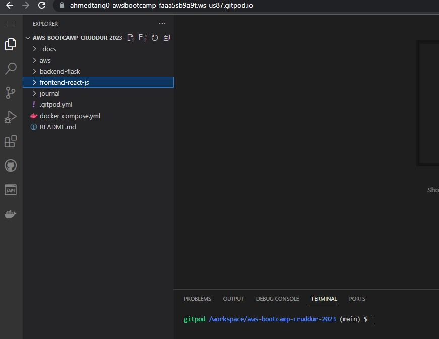

2- I Installed the requirements for the backend app to run locally using the following command

```
pip3 install -r requirements.txt
```
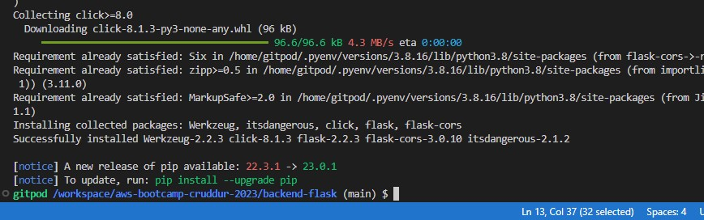

3- I ran the app locally using the following command

```
python3 -m flask run --host=0.0.0.0 --port=4567
```
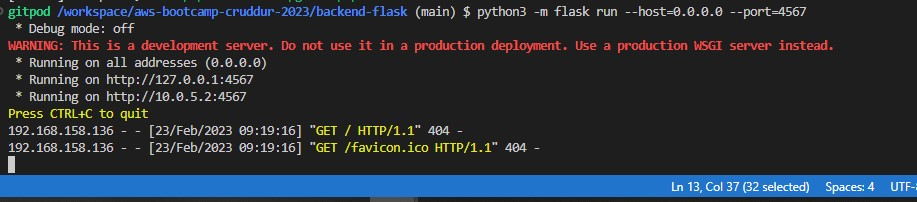

- I checked the app is running on port 4567

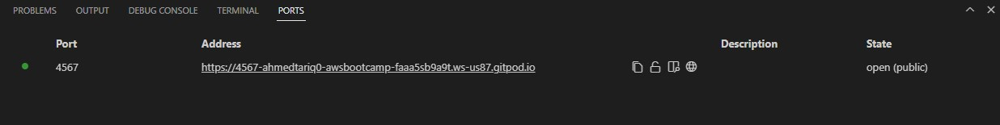

- I checked the app on the browser and it is running but giving the following error


4- I set up the environment variables for the app using the following command

```
export FRONTEND_URL="*"
export BACKEND_URL="*"
```
- I ran the app locally using the following command

```
python3 -m flask run --host=0.0.0.0 --port=4567
```
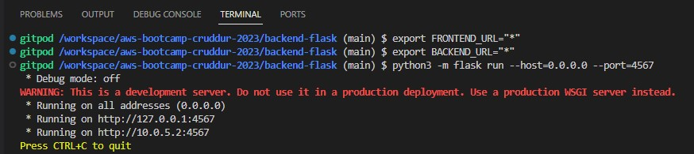

- I checked the app on the browser and it is running but giving the following error


- Then I appended the url to `/api/activities/home` and this time app is running and return the json response. I got the following response
```
https://4567-ahmedtariq0-awsbootcamp-faaa5sb9a9t.ws-us87.gitpod.io/api/activities/home
```

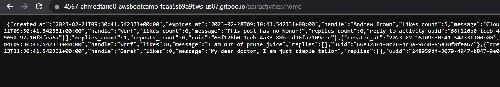

- After that I removed the environment variables using the following commands

```
unset FRONTEND_URL="*"
unset BACKEND_URL="*"
```
- Checked the environment variables are removed or not using the following command

``` 
env | grep FRONTEND_URL
env | grep BACKEND_URL
```
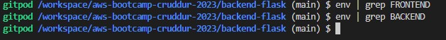

- As the app is running locally now I will create a Dockerfile for the backend app and run the app in container

5- I created a Dockerfile for the backend app here `backend-flask/Dockerfile`. Dockerfile is as follows

```
FROM python:3.10-slim-buster

# Inside container
# Create a directory for the app
WORKDIR /backend-flask

# Outside container -> Inside container
# libraries required for the app
COPY requirements.txt requirements.txt

# Inside container
# Install the python libraries used for the app
RUN pip3 install -r requirements.txt

# Outside container -> Inside container
# . means everything in the current directory
# . . means everything in the parent directory
COPY . .

ENV FLASK_ENV=development

EXPOSE ${PORT}
CMD [ "python3", "-m" , "flask", "run", "--host=0.0.0.0", "--port=4567"]
```

6- I built the container for the backend app using the following command

```
docker build -t  backend-flask ./backend-flask
```

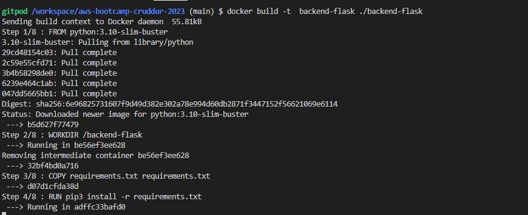

- I checked the image is created or not using the following command

```
docker images
```
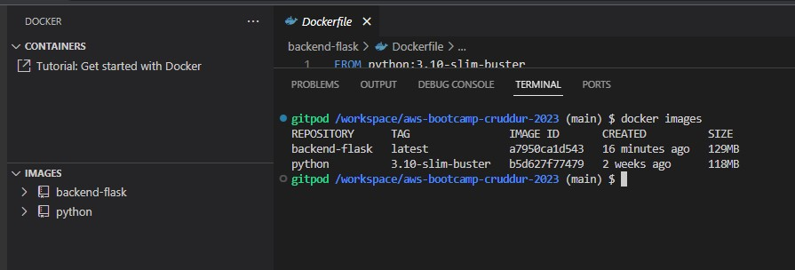

- I ran the app in container using the following command

```
docker run --rm -p 4567:4567 backend-flask
```
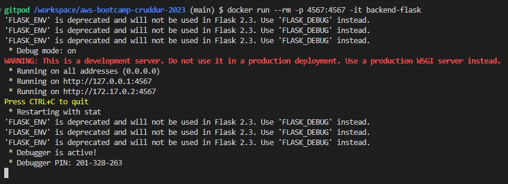

- As the app is running in container but getting the error when check on browser

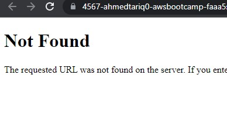

- I ran the following command to assign the environment variables to the container 

```
FRONTEND_URL="*" BACKEND_URL="*" docker run --rm -p 4567:4567 -it backend-flask
```
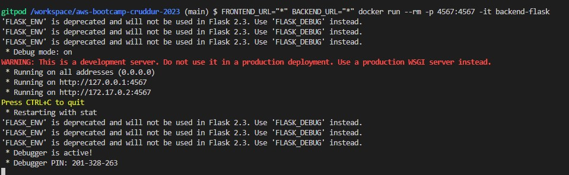

- But it still gave the same error as the syntax is wrong.


- Now I will check the logs of the app in container

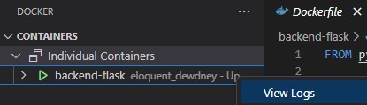

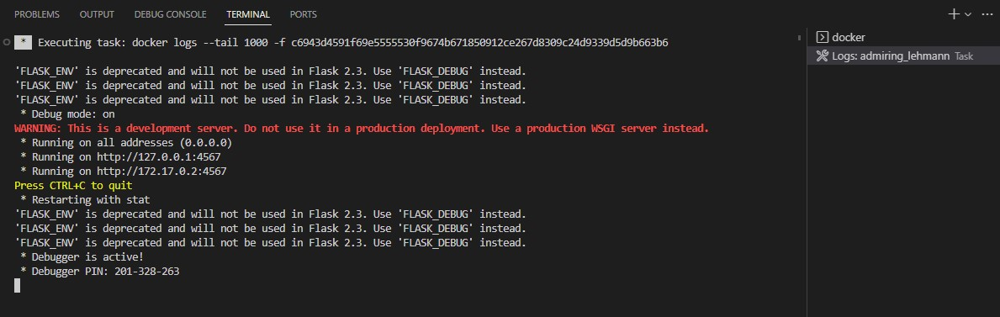


- Again running the app in container with the environment variables

```
docker run --rm -p 4567:4567 -it  -e FRONTEND_URL -e BACKEND_URL backend-flask
```
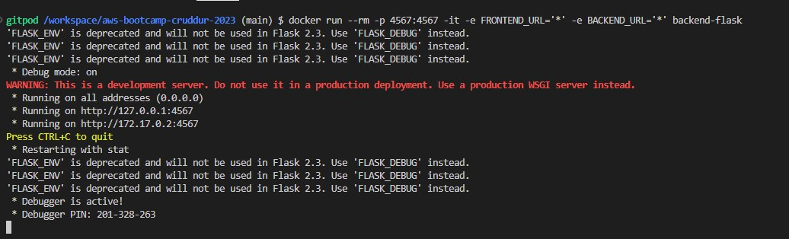

- Now the app is running in container and I can access it on the browser

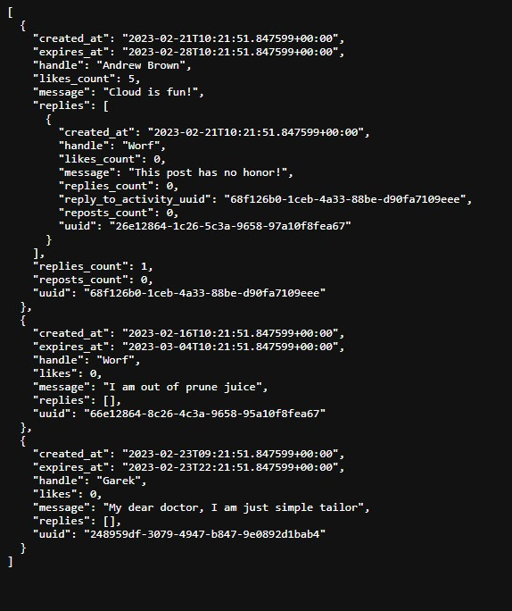

7- After that I ran the NPM Install before building the container for Frontend app

```
cd frontend-react-js
npm i
```
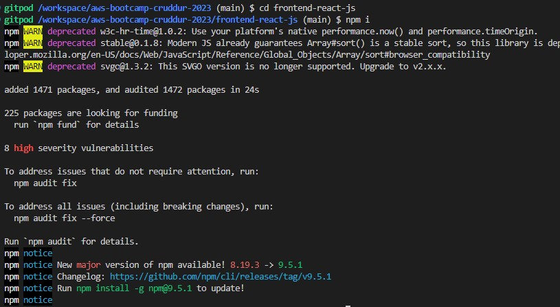


8- I created a Dockerfile for the frontend app here `frontend-react/Dockerfile`. Dockerfile is as follows

```
FROM node:16.18

ENV PORT=3000

COPY . /frontend-react-js
WORKDIR /frontend-react-js
RUN npm install
EXPOSE ${PORT}
CMD ["npm", "start"]
```

9- I built the container for the frontend app using the following command

```
docker build -t frontend-react-js ./frontend-react-js
```
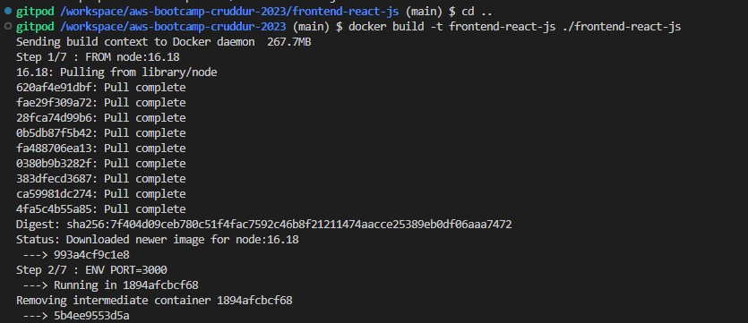

- I ran the app in container using the following command

```
docker run -p 3000:3000 -d frontend-react-js
```
10- Now I will create a docker-compose.yml file in root folder to run the app in containers. The docker-compose.yml file is as follow
```
version: "3.8"
services:
  backend-flask:
    environment:
      FRONTEND_URL: "https://3000-${GITPOD_WORKSPACE_ID}.${GITPOD_WORKSPACE_CLUSTER_HOST}"
      BACKEND_URL: "https://4567-${GITPOD_WORKSPACE_ID}.${GITPOD_WORKSPACE_CLUSTER_HOST}"
    build: ./backend-flask
    ports:
      - "4567:4567"
    volumes:
      - ./backend-flask:/backend-flask
  frontend-react-js:
    environment:
      REACT_APP_BACKEND_URL: "https://4567-${GITPOD_WORKSPACE_ID}.${GITPOD_WORKSPACE_CLUSTER_HOST}"
    build: ./frontend-react-js
    ports:
      - "3000:3000"
    volumes:
      - ./frontend-react-js:/frontend-react-js
      - /frontend-react-js/node_modules

# the name flag is a hack to change the default prepend folder
# name when outputting the image names
networks: 
  internal-network:
    driver: bridge
    name: cruddur
```
- I ran the following command to run the app in containers

```
docker-compose up
```
- Alternatively I can run the app in containers by rihgt clicking on the docker-compose.yml file and selecting the option `Compose Up`
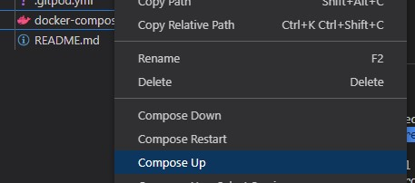

- The process is started after exceuuting the compose up
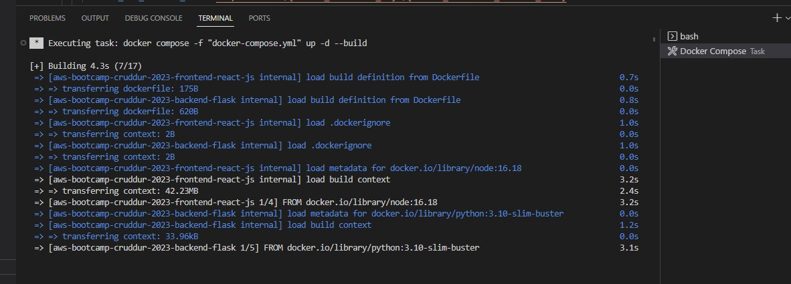

- The app is running in containers and I can access it on the browser
