# Week 2 — Distributed Tracing

## Required Homework Tasks

1- Instrument our backend flask application to use Open Telemetry (OTEL) with Honeycomb.io as the provider.
- Create a Honeycomb.io account
- Create a new environment for the project.

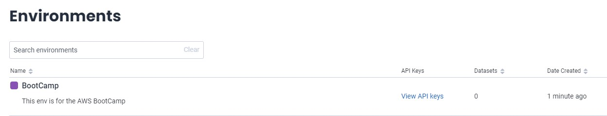

- Then copy the API key from the Honeycomb.io account and save it in the environment variables by using the following command

```sh
export HONEYCOMB_API_KEY=""
export HONEYCOMB_SERVICE_NAME="Cruddur"
```
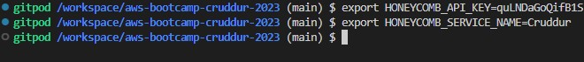

- Then setup the gitpod environment variables by using the following command

```sh

gp env HONEYCOMB_API_KEY=""
gp env HONEYCOMB_SERVICE_NAME="Cruddur"

```
- Now add the following Open Telemetry environment variables to the `backend-flask` in docker-compose.yml

```yml
OTEL_SERVICE_NAME: "back-end flask"
OTEL_EXPORTER_OTLP_ENDPOINT: "https://api.honeycomb.io"
OTEL_EXPORTER_OTLP_HEADERS: "x-honeycomb-team=${HONEYCOMB_API_KEY}"
```

- Now add the following dependencies to our `requirements.txt`

```py

opentelemetry-api 
opentelemetry-sdk 
opentelemetry-exporter-otlp-proto-http 
opentelemetry-instrumentation-flask 
opentelemetry-instrumentation-requests
```

We'll install these dependencies using the following command:

```sh
pip install -r requirements.txt
```
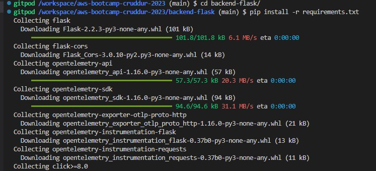

- Now add the following code to `app.py` to instrument the flask application. These updates will create and initialize a tracer and Flask instrumentation to send data to Honeycomb:

```py
from opentelemetry import trace
from opentelemetry.instrumentation.flask import FlaskInstrumentor
from opentelemetry.instrumentation.requests import RequestsInstrumentor
from opentelemetry.exporter.otlp.proto.http.trace_exporter import OTLPSpanExporter
from opentelemetry.sdk.trace import TracerProvider
from opentelemetry.sdk.trace.export import BatchSpanProcessor
```


```py
# Initialize tracing and an exporter that can send data to Honeycomb
provider = TracerProvider()
processor = BatchSpanProcessor(OTLPSpanExporter())
provider.add_span_processor(processor)
trace.set_tracer_provider(provider)
tracer = trace.get_tracer(__name__)
```

```py
# Initialize automatic instrumentation with Flask
FlaskInstrumentor().instrument_app(app)
RequestsInstrumentor().instrument()
```

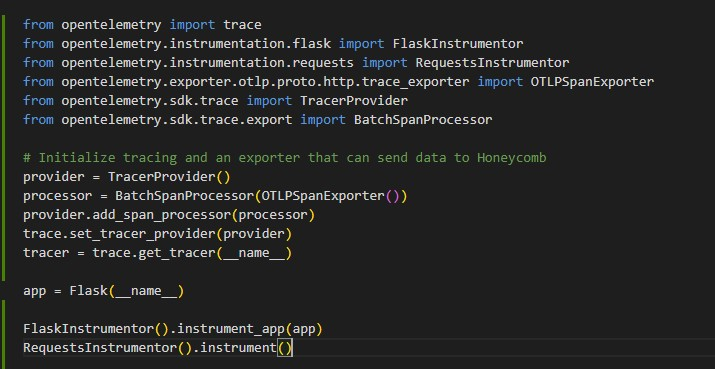

- Now docker compose up build and run the application
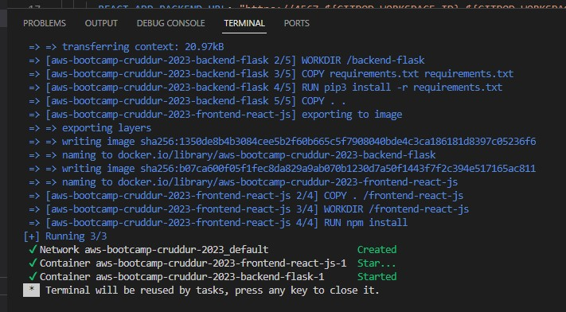

- After running the application, we can see the dataset in Honeycomb.io
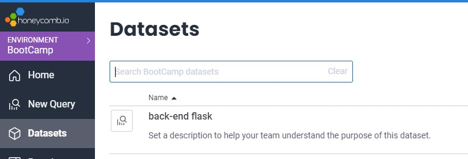

- We can also see the traces in Honeycomb.io
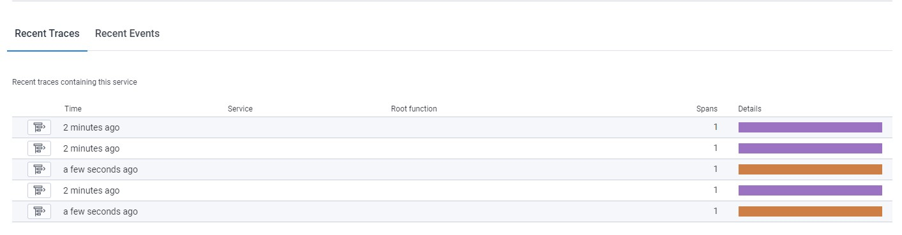

- Now to create spans we need to the following code to `home_activities.py`

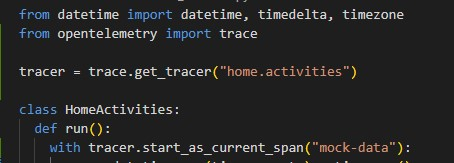

2- Run queries to explore traces within Honeycomb.io
- Now running a query to see the count traces for the `/api/activities/home` endpoint
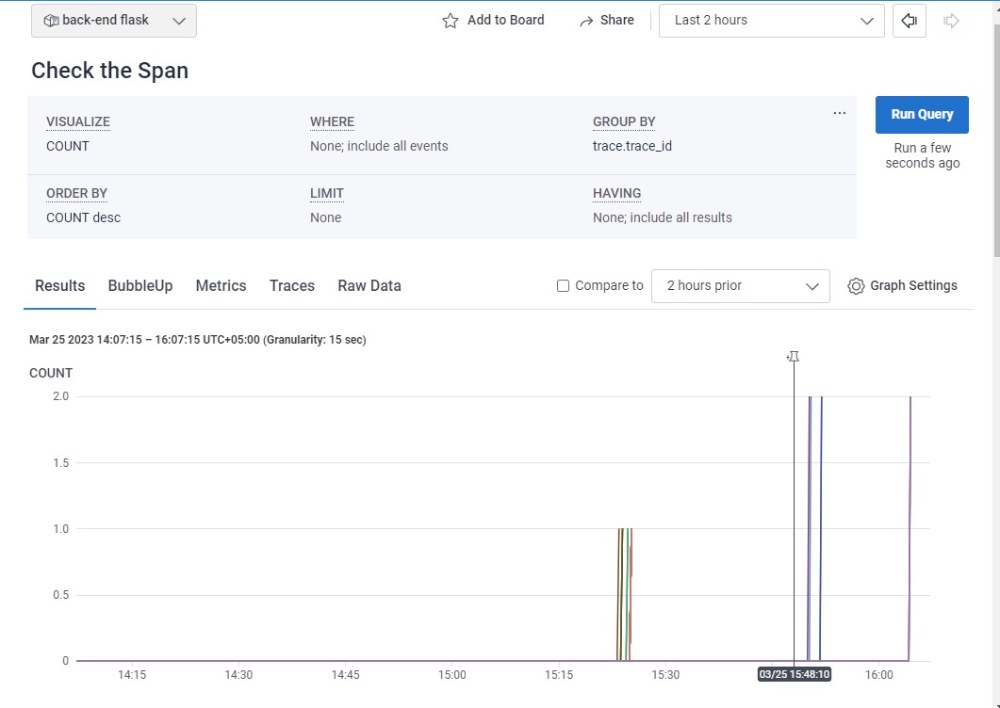

- Now running another query to see the count of app now traces at specific time for the `/api/activities/home` endpoint
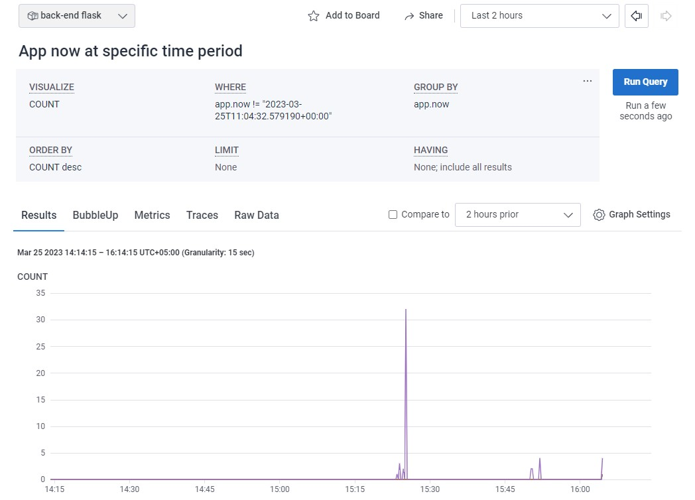

- Now running another query to see the Max duraction of app now traces at specific time for the `/api/activities/home` endpoint
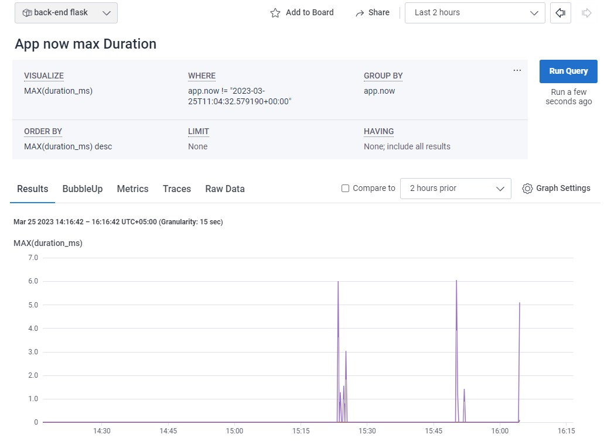

- Now running another query to see the Heatmap and the 90th percentile of app now traces at specific time for the `/api/activities/home` endpoint
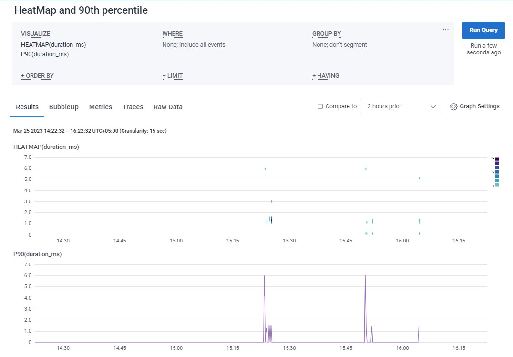

