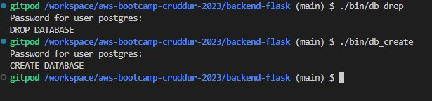
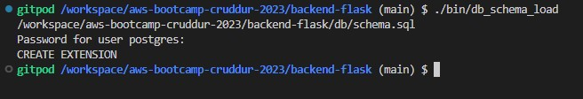
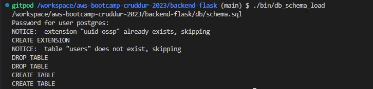

# Week 4 — Postgres and RDS

## Required Homework Tasks

- Setup aws credentials:
```sh
export AWS_ACCESS_KEY_ID=<your-access-key-id>
export AWS_SECRET_ACCESS_KEY=<your-secret-access-key>

```

1- Create a new RDS database called cruddur uisng the following command:
```sh
aws rds create-db-instance \
  --db-instance-identifier cruddur-db-instance \
  --db-instance-class db.t3.micro \
  --engine postgres \
  --engine-version  14.6 \
  --master-username root \
  --master-user-password huEE33z2Qvl383 \
  --allocated-storage 20 \
  --availability-zone us-east-1a \
  --backup-retention-period 0 \
  --port 5432 \
  --no-multi-az \
  --db-name cruddur \
  --storage-type gp2 \
  --publicly-accessible \
  --storage-encrypted \
  --enable-performance-insights \
  --performance-insights-retention-period 7 \
  --no-deletion-protection
```


2- Launch Postgres locally via a container  by adding the following code in the docker-compose file
```sh
  db:
    image: postgres:13-alpine
    restart: always
    environment:
      - POSTGRES_USER=postgres
      - POSTGRES_PASSWORD=password
    ports:
      - '5432:5432'
    volumes: 
      - db:/var/lib/postgresql/data
```

- Now build the containers using the docker-compose up command. Containers should be up and running.


- Containers are build and running


- Now connect to the postgres database using the following command:
```sh
psql -Upostgres --host localhost
```


- Create a new database called cruddur using the following command:
```sql
CREATE DATABASE cruddur;
```

- View the cruddur database using the following command:
```sql
\l
```


3- Seed our Postgres Database table with data
- Now create a schema.sql file in the db folder in the `backend-flask` folder


- Now add the following code in the schema.sql file to add UUID Extension
```sql
CREATE EXTENSION IF NOT EXISTS "uuid-ossp";
```
- Now create the extension using the following command:
```sql
psql cruddur < db/schema.sql -h localhost -U postgres
```


4- Write a DDL (for creating schema) and DML (for inserting data) script for Postgres
- Create three scripts in the bin folder in the `backend-flask` folder

 

- Add the following script in the `bin/db_create` file to create the database
```sh
#! /usr/bin/bash

NO_DB_CONNECTION_URL=$(sed 's/\/cruddur//g' <<<"psql -U postgres --host localhost")
createdb cruddur $NO_DB_CONNECTION_URL
```

- Add the following script in the `bin/db_drop` file to drop the database
```sh
#! /usr/bin/bash

NO_DB_CONNECTION_URL=$(sed 's/\/cruddur//g' <<<"psql -U postgres --host localhost")
psql $NO_DB_CONNECTION_URL -c "DROP database cruddur;"
```

- Add the following script in the `bin/db_schema_load` file to load the schema
```sh
#! /usr/bin/bash

schema_path="$(realpath .)/db/schema.sql"

echo $schema_path

NO_DB_CONNECTION_URL=$(sed 's/\/cruddur//g' <<<"psql -U postgres --host localhost")
psql $NO_DB_CONNECTION_URL cruddur < $schema_path

```

- Make the scripts executable using the following command:

```
chmod u+x bin/db_create
chmod u+x bin/db_drop
chmod u+x bin/db_schema_load
```

- Now run the following command to first drop the database and then create the database and load the schema:
```cmd
./bin.db_drop
./bin/db_create
./bin/db_schema_load
```



-5 Write a Postgres adapter for the backend application
- Update the `db/schema.sql` file to add the following code to first drop the table if it exists and then create the table:
```sql
DROP TABLE IF EXISTS public.users;
DROP TABLE IF EXISTS public.activities;

CREATE TABLE public.users (
  uuid UUID DEFAULT uuid_generate_v4() PRIMARY KEY,
  display_name text,
  handle text
  cognito_user_id text,
  created_at TIMESTAMP default current_timestamp NOT NULL
);

CREATE TABLE public.activities (
  uuid UUID DEFAULT uuid_generate_v4() PRIMARY KEY,
  message text NOT NULL,
  replies_count integer DEFAULT 0,
  reposts_count integer DEFAULT 0,
  likes_count integer DEFAULT 0,
  reply_to_activity_uuid integer,
  expires_at TIMESTAMP,
  created_at TIMESTAMP default current_timestamp NOT NULL
);

```
- Now run the following command to first drop the database and then create the database and load the schema:
```cmd
./bin/db_schema_load
```



