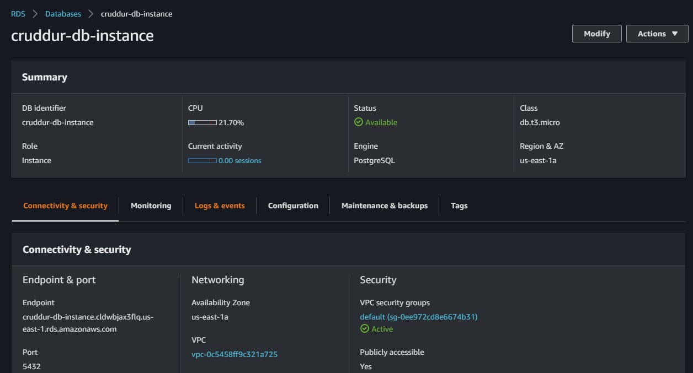

# Week 4 — Postgres and RDS

## Required Homework Tasks

- Setup aws credentials:
```sh
export AWS_ACCESS_KEY_ID=<your-access-key-id>
export AWS_SECRET_ACCESS_KEY=<your-secret-access-key>

```

1- Create a new RDS database called cruddur uisng the following command:
```sh
aws rds create-db-instance \
  --db-instance-identifier cruddur-db-instance \
  --db-instance-class db.t3.micro \
  --engine postgres \
  --engine-version  14.6 \
  --master-username root \
  --master-user-password huEE33z2Qvl383 \
  --allocated-storage 20 \
  --availability-zone us-east-1a \
  --backup-retention-period 0 \
  --port 5432 \
  --no-multi-az \
  --db-name cruddur \
  --storage-type gp2 \
  --publicly-accessible \
  --storage-encrypted \
  --enable-performance-insights \
  --performance-insights-retention-period 7 \
  --no-deletion-protection
```



2- Launch Postgres locally via a container  by adding the following code in the docker-compose file
```sh
  db:
    image: postgres:13-alpine
    restart: always
    environment:
      - POSTGRES_USER=postgres
      - POSTGRES_PASSWORD=password
    ports:
      - '5432:5432'
    volumes: 
      - db:/var/lib/postgresql/data
```

- Now build the containers using the docker-compose up command. Containers should be up and running.


- Containers are build and running


- Now connect to the postgres database using the following command:
```sh
psql -Upostgres --host localhost
```


- Create a new database called cruddur using the following command:
```sql
CREATE DATABASE cruddur;
```

- View the cruddur database using the following command:
```sql
\l
```


3- Seed our Postgres Database table with data
- Now create a schema.sql file in the db folder in the `backend-flask` folder


- Now add the following code in the schema.sql file to add UUID Extension
```sql
CREATE EXTENSION IF NOT EXISTS "uuid-ossp";
```
- Now create the extension using the following command:
```sql
psql cruddur < db/schema.sql -h localhost -U postgres
```


- Create three scripts in the bin folder in the `backend-flask` folder
 

- Add the following script in the `bin/db_create` file to create the database
```sh
#! /usr/local/bin/bash

psql -Upostgres --host localhost -c "CREATE DATABASE cruddur;"
```
- Add the following script in the `bin/db_drop` file to drop the database
```sh
#! /usr/local/bin/bash

psql -Upostgres --host localhost -c "DROP DATABASE cruddur;"
```


Write a Postgres adapter
Write a DDL (for creating schema)
Write an SQL read query
Write an SQL write query
Provision an RDS Postgres instance
Configure VPC Security Groups
Configure local backend application to use production connection URL
Add a caching layer using Momento Serverless Cache
Propagate metrics from DDB to an RDS metrics table 

